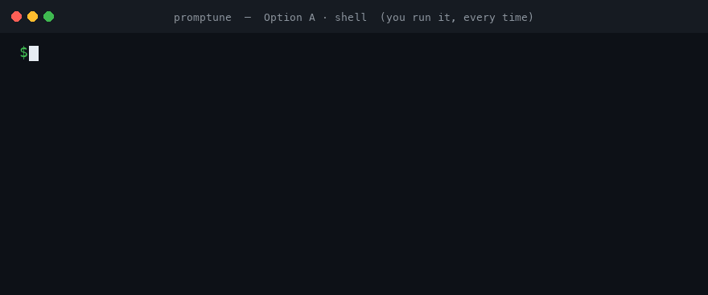
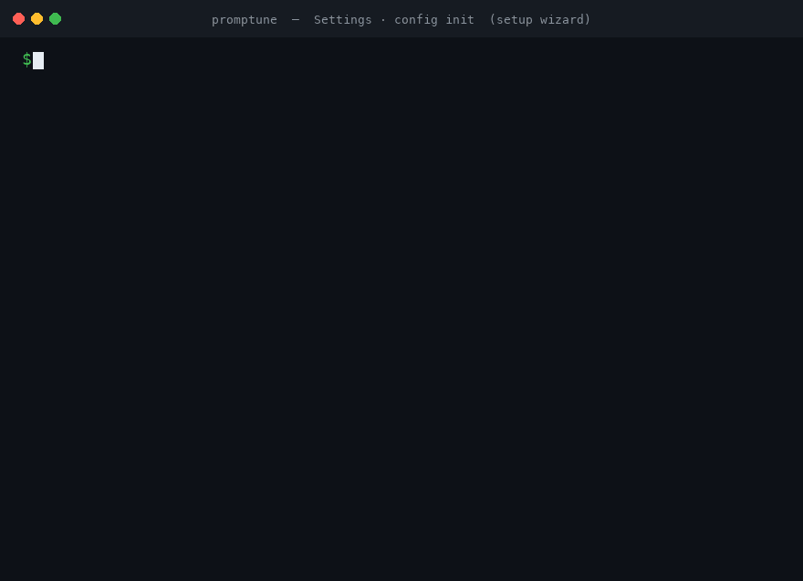
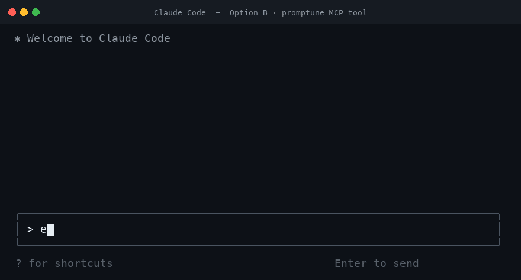
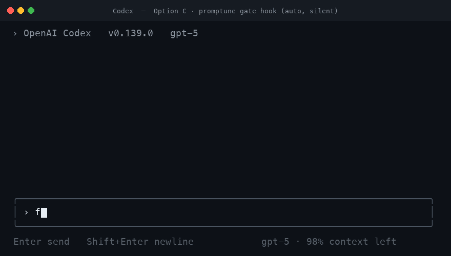

# Promptune

[](https://github.com/kayumuzzaman/promptune/actions/workflows/ci.yml)
[](https://pypi.org/project/promptune/)
[](https://pypi.org/project/promptune/)
[](LICENSE)

An intelligent AI prompt enhancer. Write a rough prompt, let Promptune analyze and improve it using rule-based, local, or cloud AI — then review the result in a rich TUI before using it.

Promptune runs **locally**. Tier 0 (rule-based) needs no API key and no network. Local and cloud tiers are opt-in.



## Contents

- [Features](#features)
- [How It Works](#how-it-works)
- [Ways to Use Promptune](#ways-to-use-promptune)
- [Compatibility](#compatibility)
- [Installation](#installation)
- [Quick Start](#quick-start)
- [CLI Commands](#cli-commands)
- [MCP Server Setup](#mcp-server-setup)
- [Auto-Enhance in AI Coding Tools](#auto-enhance-in-ai-coding-tools)
- [Shell Integration](#shell-integration)
- [System-Wide Daemon](#system-wide-daemon)
- [Configuration](#configuration)
- [Supported Providers](#supported-providers)
- [Development](#development)
- [Roadmap](#roadmap)

## Features

- **Zero-config first run**: works instantly — no setup needed for Tier 0 rule-based enhancement
- **3-tier enhancement**: deterministic rules (free, instant) → local LLM → cloud API
- **Quality scoring (PQS)**: 7-dimension prompt analysis with before/after comparison
- **Context-aware**: auto-detects git branch, tech stack, shell history, and environment
- **Provider-flexible**: Claude, OpenAI, OpenRouter, or any OpenAI-compatible local LLM
- **Rich TUI**: side-by-side diff with Accept/Edit/Reject workflow
- **System-wide daemon**: background hotkey daemon (Ctrl+Shift+E) — enhances selected text in any macOS or Linux app
- **Shell integration**: Ctrl+E widget for Zsh, Bash, and Fish — enhances prompts inline
- **MCP server**: exposes `enhance` and `score` tools to any MCP client (Claude Code, Cursor, Codex)
- **Auto-enhance hook**: intercepts low-quality prompts in AI coding tools, enhances them, and silently injects the enhanced prompt as context
- **Provider-specific formatting**: auto-selects XML, Markdown, or Plain based on target model
- **Interactive setup wizard**: guided config init with provider selection and masked API key input
- **Semantic deduplication**: detects near-duplicate prompts and returns cached results instantly
- **Preference learning**: learns from accept/reject/edit decisions to skip disliked rules automatically
- **Team templates**: `.prompts/` directory with intent/domain matching and variable injection
- **Enhancement history**: SQLite-backed history with statistics and acceptance tracking
- **System health check**: `promptune doctor` verifies config, tiers, shell, and hook status
- Configurable enhancement styles: minimal, balanced, detailed
- TOML-based configuration

## How It Works

Every entry point funnels a raw prompt through the same routing engine and returns an enhanced prompt plus a quality score.

```
raw prompt
    │
    ▼
┌─────────────────┐   cache hit
│ 1. Dedup check  │ ──────────────► return cached enhancement (instant)
└─────────────────┘
    │ miss
    ▼
┌─────────────────┐
│ 2. Tier 0 rules │  9 deterministic rewrite rules (free, offline, ~0 ms)
└─────────────────┘
    │
    ▼
┌─────────────────┐   score ≥ 70
│ 3. Re-score PQS │ ──────────────► done — return Tier 0 result
└─────────────────┘
    │ score < 70  (and max_tier allows)
    ▼
┌─────────────────┐   fails / unavailable
│ 4. Tier 1 local │ ──────────────┐
└─────────────────┘               │ graceful fallback
    │ still weak                  ▼
    ▼                       (drop to tier below)
┌─────────────────┐
│ 5. Tier 2 cloud │  Claude / OpenAI / OpenRouter
└─────────────────┘
    │
    ▼
context injection · preference filtering · template match · provider formatting
    │
    ▼
enhanced prompt + before/after PQS
```

**Tiers**

| Tier | Engine | Cost | Needs |
|------|--------|------|-------|
| 0 | 9-rule deterministic rewrite engine | Free, instant, offline | Nothing |
| 1 | Local LLM (Ollama / any OpenAI-compatible) | Free, local | `[local_llm] enabled = true` |
| 2 | Cloud API | Paid | Provider API key |

The router always tries the cheapest tier first and **degrades gracefully** — if a tier fails or is unavailable, it falls back to the tier below. `max_tier` (config) caps how far it climbs; `--tier N` forces one tier.

**Quality Score (PQS)** rates a prompt 0–100 across 7 dimensions (specificity, clarity, structure, actionability, context, completeness, conciseness) and drives both the routing decision and the auto-enhance gate.

## Ways to Use Promptune

Five surfaces, one engine. Pick whichever fits your workflow:

| Way | Trigger | Best for |
|-----|---------|----------|
| **CLI** | `promptune enhance "..."` | Scripting, one-offs, piping |
| **Shell widget** | **Ctrl+E** in your terminal | Enhancing the command line you're typing |
| **System daemon** | **Ctrl+Shift+E** anywhere | Enhancing selected text in any app (browser, editor, chat) |
| **MCP server** | Ask your AI tool to enhance/score | Inside Claude Code, Cursor, Codex, or any MCP client |
| **Auto-enhance hook** | Automatic on prompt submit | Upgrading weak prompts in tools that expose a hook (Claude Code, Codex) |

Not every AI tool can auto-trigger Promptune. See [Auto-Enhance in AI Coding Tools](#auto-enhance-in-ai-coding-tools) for the per-tool support matrix.

## Compatibility

The **CLI runs in every terminal and OS** — it's a plain Python program. The convenience integrations are constrained not by your terminal emulator but by your **shell** (the inline widget) and your **OS** (the system daemon).

| Surface | macOS | Linux | Windows | Requirements |
|---------|:-----:|:-----:|:-------:|--------------|
| **CLI** (`enhance` / `score` / `doctor` …) | ✅ | ✅ | ✅ | Python 3.9+; any terminal emulator |
| **Interactive TUI** (Accept/Edit/Reject) | ✅ | ✅ | ✅ | a real TTY (ANSI) — degrades in pipes |
| **Shell widget** (Ctrl+E inline) | ✅ | ✅ | ⚠️ via WSL / Git Bash | **zsh / bash / fish** only — ❌ Warp, PowerShell, nushell, cmd |
| **System daemon** (Ctrl+Shift+E global) | ✅ | ✅ X11 / Wayland | ❌ | macOS: Accessibility grant · Linux X11: `xclip` + `xdotool` · Wayland: `wl-clipboard` + `ydotool` + `input` group |
| **Auto-enhance hook** (silent gate) | ✅ | ✅ | ✅ | tool exposing a `UserPromptSubmit` hook → **Claude Code, Codex** |
| **MCP server** | ✅ | ✅ | ✅ | any MCP client (Claude Code, Cursor, Codex …) |

**Terminal emulators:** the CLI, TUI, and widget work in iTerm2, kitty, Alacritty, GNOME Terminal, Windows Terminal, tmux, and over SSH. The one explicit exception is the **Ctrl+E widget in Warp**, which Warp's input model doesn't support (`promptune doctor` flags it and points you to `promptune enhance`).

> `promptune doctor` reports exactly what's available on your machine — tiers, shell-widget compatibility, daemon permissions, and the auto-enhance hook per detected tool.

## Installation

### Recommended — pipx (macOS + Linux)

```bash
pipx install promptune        # or: python3 -m pip install --user promptune
promptune config init
```

Verify with `promptune --version`, then `promptune doctor`.

### Optional extras

Install **with** the extras you want — use one of these *instead of* the base command above:

```bash
pipx install "promptune[mcp]"               # + MCP server (enables `promptune mcp`)
pipx install "promptune[mcp,linux-daemon]"  # + MCP and Linux system-daemon support
```

Already installed plain `promptune`? Add the deps to the existing pipx venv instead (a second `pipx install` is a no-op):

```bash
pipx inject promptune "mcp>=1.0"                    # MCP server
pipx inject promptune python-xlib dbus-next evdev   # Linux daemon
```

The Linux system-wide hotkey daemon also needs OS tools:

```bash
sudo apt install xclip xdotool        # X11
sudo apt install wl-clipboard ydotool # Wayland (+ add yourself to the 'input' group)
```

### One-line installer (macOS + Linux)

```bash
curl -fsSL https://raw.githubusercontent.com/kayumuzzaman/promptune/main/install.sh | bash
```

Or inspect before running:

```bash
curl -fsSL https://raw.githubusercontent.com/kayumuzzaman/promptune/main/install.sh -o install.sh
bash install.sh
```

### For development

```bash
git clone https://github.com/kayumuzzaman/promptune.git
cd promptune
pip install -e ".[dev]"
```

## Quick Start

```bash
# 1. Interactive setup wizard — provider, API key, shell widget, AI-tool hooks + MCP
promptune config init

# 2. Enhance a prompt
promptune enhance "make a todo app"

# 3. Set up the shell widget (Zsh/Bash/Fish)
echo 'eval "$(promptune shell-init)"' >> ~/.zshrc
source ~/.zshrc

# 4. Verify everything
promptune doctor
```

Now press **Ctrl+E** in your terminal to enhance the current line.

> `promptune config init` also detects installed AI coding tools (Claude Code, Codex CLI, …) and offers to install the [auto-enhance hook](#auto-enhance-in-ai-coding-tools) and register the [MCP server](#mcp-server-setup) for you. Both are optional.

_The setup wizard:_



## CLI Commands

Run `promptune --help` for the full list, or `promptune <command> --help` for any command.

### `promptune enhance`

Enhance a prompt using AI. Opens a TUI with Accept/Edit/Reject workflow by default.

_With `--no-tui`, the enhanced prompt prints straight to stdout — pipe it anywhere:_


```bash
# Basic — opens TUI with before/after comparison
promptune enhance "make a todo app"

# Override provider for this command
promptune enhance -p openai "optimize this SQL query"

# Override enhancement style
promptune enhance -s detailed "build a payment system"

# Force a specific tier (0=rules only, 1=local LLM, 2=cloud API)
promptune enhance --tier 0 "fix the login bug"

# Skip TUI, print enhanced prompt directly to stdout
promptune enhance --no-tui "add dark mode to my react app"

# Get structured JSON output
promptune enhance --json "write unit tests for the auth module"

# Pipe input
echo "build a REST API" | promptune enhance --no-tui

# Enhance and copy to clipboard (macOS)
promptune enhance --no-tui "refactor the user service" | pbcopy

# Combine flags
promptune enhance -p openrouter -s detailed --no-tui "design a caching layer"
```

**All flags:**

| Flag | Short | Description |
|------|-------|-------------|
| `--provider` | `-p` | Override default provider (claude, openai, openrouter) |
| `--style` | `-s` | Override enhancement style (minimal, balanced, detailed) |
| `--tier` | | Force specific tier: 0 (rules only), 1 (local LLM), 2 (cloud API) |
| `--no-tui` | | Print result directly to stdout, skip interactive TUI |
| `--json` | | Output structured JSON with scores, tier, latency |

### `promptune score`

Score a prompt across 7 quality dimensions (0–100 PQS) without enhancing it — shows a per-dimension breakdown and actionable suggestions.

```bash
promptune score "make a todo app"
promptune score --json "build a REST API with JWT auth"
echo "add dark mode" | promptune score
```

### `promptune config`

Manage configuration.

```bash
promptune config init                                   # interactive setup wizard
promptune config --set-key claude sk-ant-your-key-here  # set a provider API key
promptune config --set-tier 2                           # set max enhancement tier
promptune config --reset                                # reset config to defaults
promptune config show                                   # show current configuration
promptune config path                                   # print config file path
```

### `promptune shell-init`

Output the shell widget script. Auto-detects shell, or specify one. See [Shell Integration](#shell-integration).

```bash
eval "$(promptune shell-init)"                       # auto-detect shell
eval "$(promptune shell-init --shell bash)"          # force a shell
eval "$(promptune shell-init --key 'alt+e')"         # custom keybinding
eval "$(promptune shell-init --key 'ctrl+x ctrl+e')"
```

### `promptune doctor`

Run a system health check — verifies Python version, config, tier availability, shell widget compatibility, and the auto-enhance hook / MCP status for each detected AI tool.

```bash
promptune doctor
```

### `promptune history`

View enhancement history stored in SQLite.

```bash
promptune history                # recent entries
promptune history --n 50         # last 50 entries
promptune history --stats        # acceptance rate, score improvements
promptune history --clear        # clear all history
promptune history --preferences  # show learned preferences
```

### `promptune daemon`

Background daemon for system-wide prompt enhancement. See [System-Wide Daemon](#system-wide-daemon).

```bash
promptune daemon start --foreground   # run in foreground (debugging)
promptune daemon start                # run as background process
promptune daemon status               # check status
promptune daemon stop                 # stop
promptune daemon setup                # grant permissions / install deps
promptune daemon diagnose             # run diagnostics
promptune daemon install              # install system service (systemd / LaunchAgent)
promptune daemon uninstall            # remove system service
promptune daemon purge                # remove all daemon files
promptune daemon install-login-item   # legacy macOS-only
promptune daemon uninstall-login-item # legacy macOS-only
```

### `promptune mcp`

Start the MCP server (stdio transport). See [MCP Server Setup](#mcp-server-setup).

```bash
promptune mcp
```

### `promptune local-llm-status`

Check local LLM (Ollama) connectivity.

```bash
promptune local-llm-status
```

### `promptune version`

```bash
promptune version
```

## MCP Server Setup

Promptune ships an [MCP](https://modelcontextprotocol.io) server (`promptune mcp`, stdio transport) that exposes two tools to any MCP-compatible AI tool:

_Claude Code calling the `enhance` tool, then acting on the refined prompt:_



| Tool | Arguments | Returns |
|------|-----------|---------|
| `enhance_prompt` | `prompt` (str), `style` = `balanced`, `tier` = `-1` (auto) | Enhanced prompt, tier used, before/after scores |
| `score_prompt_quality` | `prompt` (str) | Total PQS, detected intent, per-dimension breakdown + suggestions |

Requires the MCP extra:

```bash
pip install "promptune[mcp]"
```

### Option A — automatic (recommended)

`promptune config init` detects installed AI tools and offers to register the MCP server for you (written to `~/.claude/settings.json`). Verify with `promptune doctor`.

### Option B — Claude Code (manual)

```bash
claude mcp add promptune -- promptune mcp
```

Or add it directly to `~/.claude/settings.json` (or a project `.mcp.json`):

```json
{
  "mcpServers": {
    "promptune": {
      "command": "promptune",
      "args": ["mcp"]
    }
  }
}
```

### Option C — Cursor / Codex / other MCP clients

Point your client's MCP config at the same command. Generic shape:

```json
{
  "mcpServers": {
    "promptune": {
      "command": "promptune",
      "args": ["mcp"]
    }
  }
}
```

If `promptune` is not on the tool's `PATH`, use the absolute path (find it with `which promptune`).

### Using it

Once registered, ask your AI assistant naturally — e.g. *"score this prompt"* or *"enhance this prompt before we start"* — and it will call the `score_prompt_quality` / `enhance_prompt` tools.

## Auto-Enhance in AI Coding Tools

The auto-enhance hook intercepts prompts you submit in an AI coding tool, and when a prompt looks weak it enhances it and silently injects the improved version into the conversation as context — no clipboard, no manual paste.

_A weak prompt silently enhanced and injected inside Codex (`!` bypasses):_



### Which tools auto-trigger?

Promptune integrates with AI coding tools two ways: an **auto-enhance hook** (fires automatically on every prompt you submit inside the tool's interactive session) and the **MCP server** (the model calls Promptune on request — never automatic). A tool can only auto-trigger if it exposes a `UserPromptSubmit` hook *and* Promptune ships an installer for it.

| Tool | Auto-trigger on prompt submit? | How |
|------|-------------------------------|-----|
| **Claude Code** | ✅ Yes | `UserPromptSubmit` hook in `~/.claude/settings.json` |
| **Codex CLI** | ✅ Yes | `UserPromptSubmit` hook in `~/.codex/hooks.json` |
| **Cursor / other MCP clients** | ❌ No | Use the [MCP server](#mcp-server-setup) (ask the tool to enhance) or run `promptune enhance` manually and paste/pipe the result |

> **Note on injection vs. replacement:** the gate does **not** literally replace or overwrite the prompt text you typed — neither Claude Code nor Codex allows a hook to do that. Instead it **injects the enhanced prompt as additional context alongside your original**, so the model receives both and acts on the enhanced version automatically. The `!` bypass prefix still sends your prompt through raw, with no enhancement and no injection.

**How it works** — the installer adds a `UserPromptSubmit` hook (to `~/.claude/settings.json` for Claude Code, or `~/.codex/hooks.json` for Codex CLI) that pipes each submitted prompt into `promptune gate`. Both tools use the same hook shape and pass the prompt in the same `prompt` field, so the one gate works for both. The gate:

1. Skips if auto-enhance is disabled.
2. Skips if the prompt starts with the **bypass prefix** (`!` by default).
3. Skips prompts shorter than `min_words`.
4. Scores the prompt; if PQS ≥ `threshold`, lets it through unchanged.
5. Otherwise enhances it and injects the enhanced prompt into the model's context via the hook's `additionalContext` output (exit 0, the prompt proceeds), so the model acts on the enhanced version automatically — no clipboard, no paste.

### Install

Run the wizard and accept the auto-enhance prompt when it detects your tool (Claude Code, Codex CLI, …):

```bash
promptune config init
```

Verify — `doctor` prints an Auto-enhance status line per detected tool (Claude Code when `~/.claude/` exists, Codex when `~/.codex/` exists):

```bash
promptune doctor   # shows: Auto-enhance ✓ <tool> (threshold: NN)
```

### Manual (Claude Code)

Add to `~/.claude/settings.json`:

```json
{
  "hooks": {
    "UserPromptSubmit": [
      {
        "matcher": "",
        "hooks": [
          { "type": "command", "command": "promptune gate" }
        ]
      }
    ]
  }
}
```

### Manual (Codex CLI)

Add to `~/.codex/hooks.json` (same shape — Codex's `UserPromptSubmit` payload uses the same `prompt` field):

```json
{
  "hooks": {
    "UserPromptSubmit": [
      {
        "matcher": "",
        "hooks": [
          { "type": "command", "command": "promptune gate" }
        ]
      }
    ]
  }
}
```

### Tune it

```toml
[auto_enhance]
enabled = true        # master switch
threshold = 40        # enhance prompts scoring below this PQS
min_words = 5         # ignore very short prompts
bypass_prefix = "!"   # prefix a prompt with this to skip enhancement
```

Type `!just do exactly this` to bypass on a per-prompt basis.

## Shell Integration

Add the widget to your shell rc file, then press **Ctrl+E** to enhance the line you're typing in place. Works in Zsh, Bash, and Fish.

```bash
# Zsh — ~/.zshrc
eval "$(promptune shell-init)"

# Bash — ~/.bashrc
eval "$(promptune shell-init --shell bash)"

# Fish — ~/.config/fish/config.fish
promptune shell-init --shell fish | source
```

Rebind the key with `--key` (e.g. `--key 'alt+e'`). The widget talks to the running daemon over a Unix socket when available, so enhancements stay fast.

## System-Wide Daemon

The daemon registers a global hotkey (**Ctrl+Shift+E** by default) that enhances **selected text in any application** — copy is simulated, the selection is enhanced, and the result is pasted back. Supported on macOS (CGEventTap) and Linux (X11 and Wayland).

```bash
promptune daemon setup     # grant Accessibility (macOS) / install deps (Linux)
promptune daemon start     # start in the background
promptune daemon install   # auto-start at login (LaunchAgent / systemd)
promptune daemon status    # confirm it's running
```

On Linux, install the platform tools the daemon shells out to (`xclip`/`xdotool` for X11, `wl-clipboard`/`ydotool` for Wayland); `promptune daemon diagnose` reports what's missing.

Daemon behavior (hotkey, clipboard settle time, notifications, Ollama pre-warm) is configured under `[daemon]` in the config file.

## Configuration

Config lives at `~/.config/promptune/config.toml`. Create and edit it interactively with `promptune config init`, or see `config.example.toml` for every option with defaults.

**Resolution order:** CLI flags > environment variables > config file > defaults

Environment variables: `PROMPTUNE_PROVIDER`, `PROMPTUNE_STYLE`

Key sections:

| Section | Controls |
|---------|----------|
| `[provider]` | Default provider and per-provider model |
| `[api_keys]` | Claude / OpenAI / OpenRouter keys |
| `[enhancement]` | `max_tier`, default style, dedup, preference learning |
| `[local_llm]` | Ollama / OpenAI-compatible host + model (Tier 1) |
| `[context]` | Git / shell-history / stack-detection toggles |
| `[history]` | SQLite history location + size |
| `[tui]` | TUI display options |
| `[daemon]` | Global hotkey + daemon behavior |
| `[auto_enhance]` | Hook threshold, min words, bypass prefix |

## Supported Providers

| Provider | SDK | Config Key |
|----------|-----|-----------|
| Claude | `anthropic` | `[api_keys] claude = "sk-ant-..."` |
| OpenAI | `openai` | `[api_keys] openai = "sk-..."` |
| OpenRouter | `httpx` | `[api_keys] openrouter = "sk-or-..."` |
| Local LLM | OpenAI-compatible | `[local_llm] host = "http://localhost:11434"` |

## Development

```bash
pip install -e ".[dev]"

# Full check (lint + types + tests), as CI runs it
ruff check . && mypy promptune/ && pytest -m "not linux" --cov=promptune --cov-report=term-missing --cov-fail-under=85

# Tests only
pytest -m "not linux" -v
```

CI runs on Linux (Python 3.12 and 3.13). macOS-only daemon tests self-skip there, and `-m "not linux"` excludes the real-hardware X11/Wayland integration tests. Coverage gate: ≥ 85%.

## Roadmap

- [x] Phase 1: Core CLI, providers, TUI, shell integration (Zsh/Bash/Fish)
- [x] Phase 1.1: 3-tier enhancement, quality scoring, context fingerprinting, SQLite history
- [x] Phase 1.2: Interactive config setup wizard
- [x] Enhancement Phase: Preference learning, semantic deduplication, team templates, Ollama auto-check
- [x] Phase 2: OS-level hotkey daemon (macOS) — system-wide Ctrl+Shift+E
- [x] Phase 3: Linux hotkey daemon — X11 and Wayland support via platform abstraction
- [x] MCP server, auto-enhance gate, AI-tool hooks, `score` command

## License

MIT
